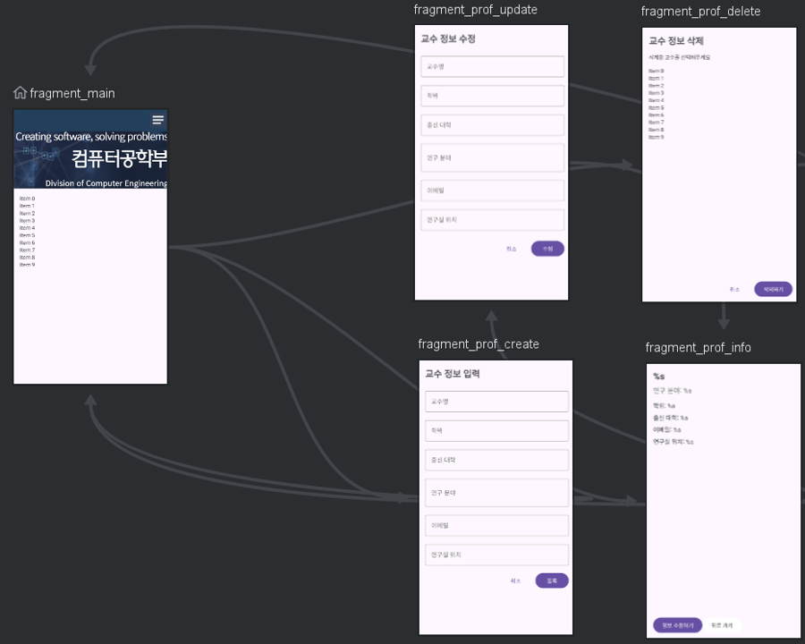
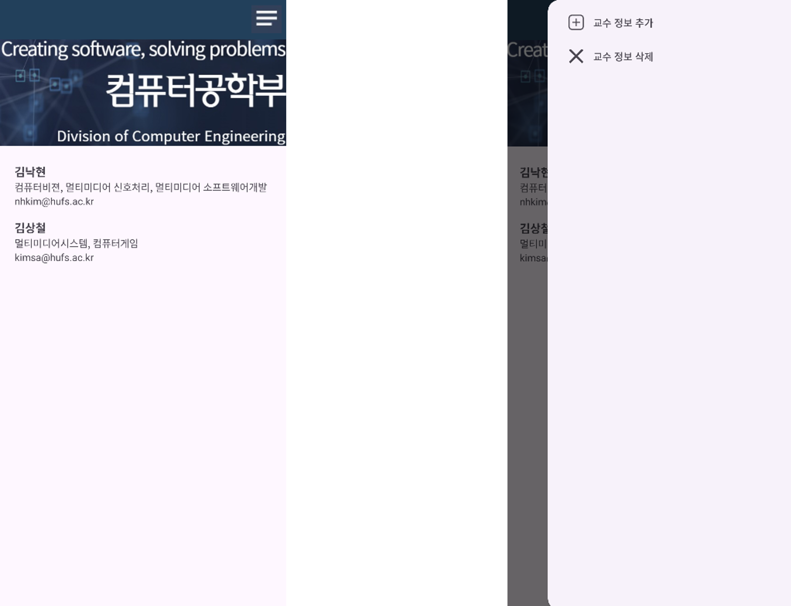
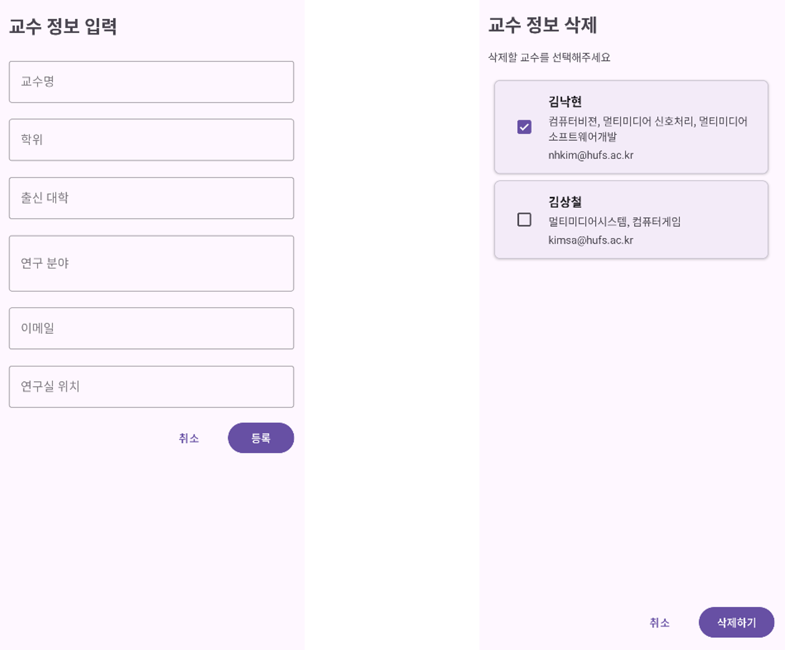
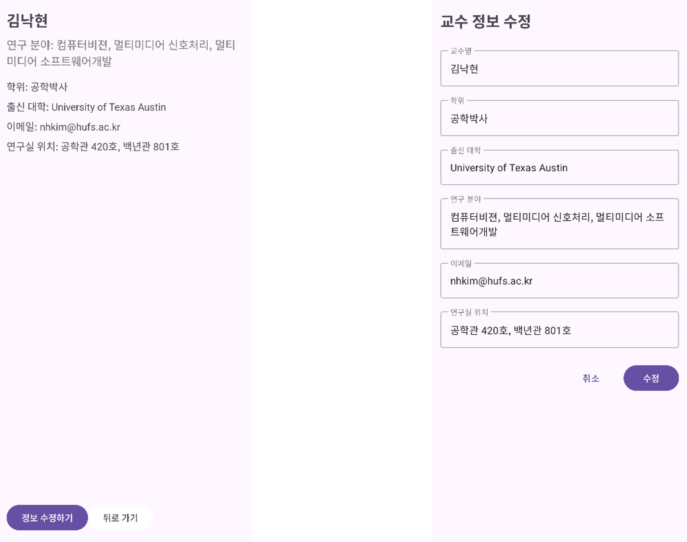
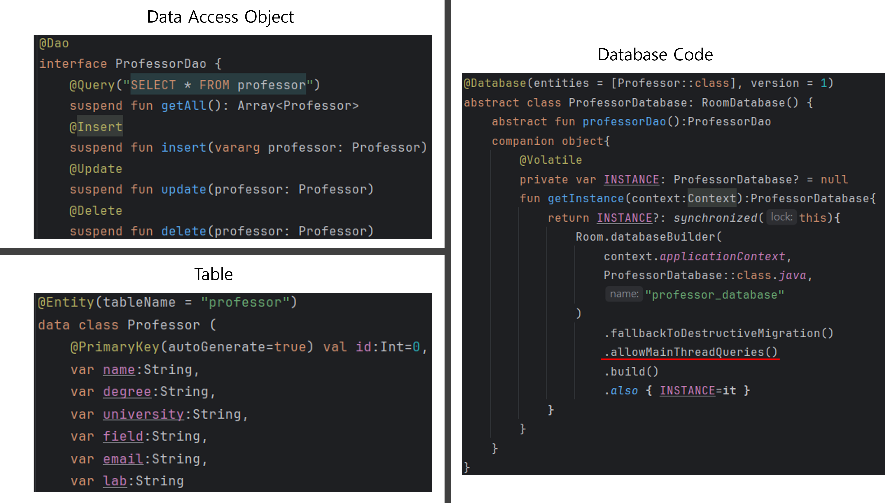

# Faculty Management App

> Android application for managing faculty members in the Department of Computer Science.

---

## Overview

This project was developed as a team assignment for a mobile programming course. The app allows users to manage faculty information through an Android application that utilizes modern architectural components and persistent storage.

- **Project Title**: Faculty Management App
- **Platform**: Android (Kotlin)
- **Project Goal**: To provide an efficient mobile interface for adding, editing, viewing, and deleting faculty information.
- **Development Period**: October 2024 – November 2024

---

## Features

- View a list of all faculty members
- View detailed information for each faculty member
- Add new faculty information
- Edit and delete existing information
- Structured navigation using fragments
- Live data binding and MVVM architecture
- Local data persistence with Room database

---

## Technical Stack

| Category      | Technology                       |
| ------------- | -------------------------------- |
| Language      | Kotlin                           |
| Architecture  | MVVM (ViewModel + LiveData)      |
| UI            | Fragments + Navigation Component |
| Database      | Room (SQLite-based)              |
| IDE           | Android Studio                   |
| Collaboration | GitHub                           |

---

## Project Structure

```
TeamProject/
├── app/
│   ├── src/
│   │   ├── main/
│   │   │   ├── java/com/example/facultymanagement/
│   │   │   │   ├── dao/
│   │   │   │   ├── database/
│   │   │   │   ├── model/
│   │   │   │   ├── ui/
│   │   │   │   └── viewmodel/
│   │   │   ├── res/
│   │   │   └── AndroidManifest.xml
└── README.md
```

---

## Role and Contribution

| Name        | Role and Responsibilities                                                |
|-------------|---------------------------------------------------------------------------|
| Daehan Kim  | Main page, ViewModel, Database design and implementation, system integration |
| Taeho Kim   | Edit page, Detail page                                                   |
| Minje Koo   | Add page, Delete page                                                    |

---

## Screenshots

### 1. App Navigation Overview
> Overall navigation structure of the application

📌 *Slide 3: Navigation Graph*



---

### 2. Core Screens

| Main Page             | Add Page              | Edit Page             |
|-----------------------|-----------------------|-----------------------|
|  |  |  |

---

### 3. Database Schema (Optional)
> Visual representation of the Room database structure

📌 *Slide 8: DB Structure*



---

## License

This project is developed for educational purposes and is not intended for commercial use.
